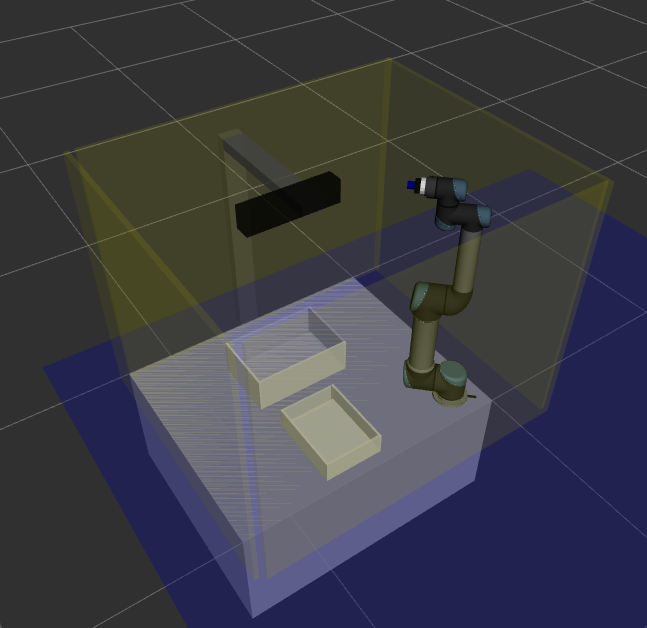

# Project AIvengers/Pick-and-place for UR5

## Installation

The content of the repository should be cloned into the source of catkin workspace:
```
mkdir -p ur5_pnp_ws/src
cd ur5_pnp_ws/src
git clone --recursive https://github.com/vfdev-5/ur5_pnp.git
```

Before compilation, install dependencies:
```
cd ur5_pnp_ws && rosdep install --from-paths src --ignore-src -r -y
```
and finally compile the workspace
```
cd ur5_pnp_ws && catkin_make
```

## Usage 

### Robot initialization

Two options are possible:
- simulation
- real robot

#### Simulation
```
source devel/setup.bash
sh src/ur5_pnp/run_simulation.sh
```



#### Real robot
Just run the script from the root of the workspace (`build`, `devel`, `src`):
```
sh src/ur5_pnp/run_robot.sh
```
which starts `roscore` and necessary nodes in separate `xterm` windows.

### Play with robot 

Multiple options are possible:
- execute a program
- use moveit commander

#### Execute a program

Main demo program can be executed with
```
source devel/setup.bash
roslaunch move_group_ur5 demo_gqcnn_pick_and_drop_single_object.launch
```

This demo requires `berkeley_automation` module properly installed.


There are other demo programs can be found at `move_group_ur5/programs`.

#### Moveit commander

Simply run the script
```
sh run_commander.sh
```
Next in the command line type:
```
> use manipulator
> current
> help
```

