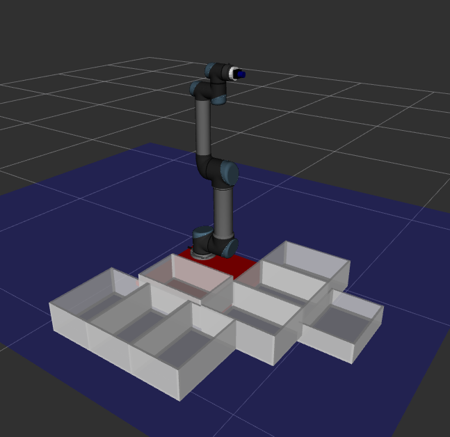

# Project AIvengers/Pick-and-place for UR5

## Installation

The content of the repository should be cloned into the source of catkin workspace:
```
mkdir -p ur5_pnp_ws/src
cd ur5_pnp_ws/src
git clone https://github.com/vfdev-5/ur5_pnp.git
``` 
Before compilation, install dependencies:
```
cd ur5_pnp_ws && rosdep install --from-paths src --ignore-src -r -y
```
and finally compile the workspace
```
cd ur5_pnp_ws && catkin_make
```

## Usage 

### Simulation
```
source devel/setup.bash
roslaunch ur5_moveit_config demo.launch
```

